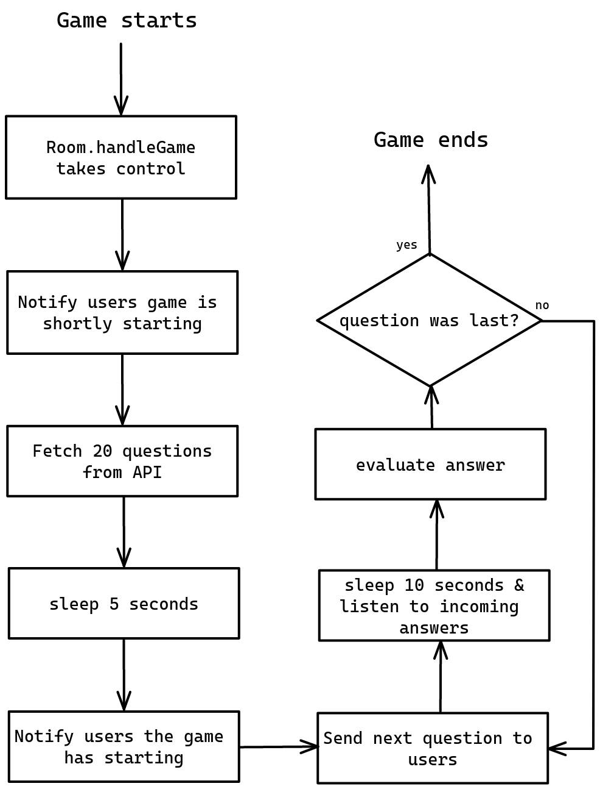

# About

This file documents outlines the procedures taken by the the client side and the server side to make ends meet, sorta speak.

   

# Server WebSocket handling

   

# Client WebSocket handling

   

# Server game handling

